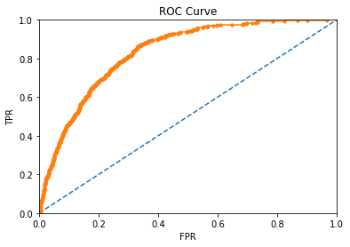
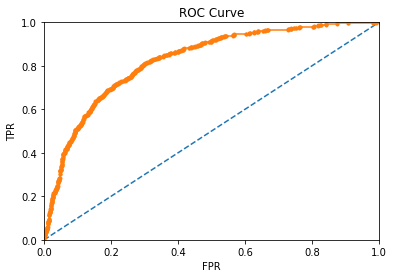
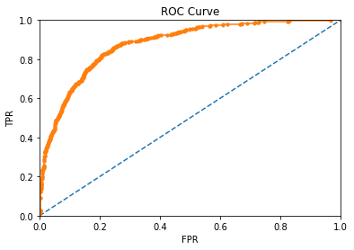
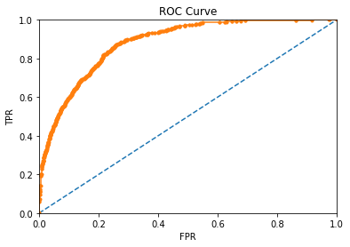

# pneumonia-rsna

Pneumonia data is from the Kaggle RSNA competition. I trained a densenet121 on the data for classification.

The following figures show the ROC plots of for the validation and test splits.

The following figures show the ROC plots of for the validation and test splits with data augementation during training.

AUC of 0.881 is much better than the pneumonia AUC of 0.768 in the Stanford Chexnet paper(https://arxiv.org/pdf/1711.05225.pdf)

